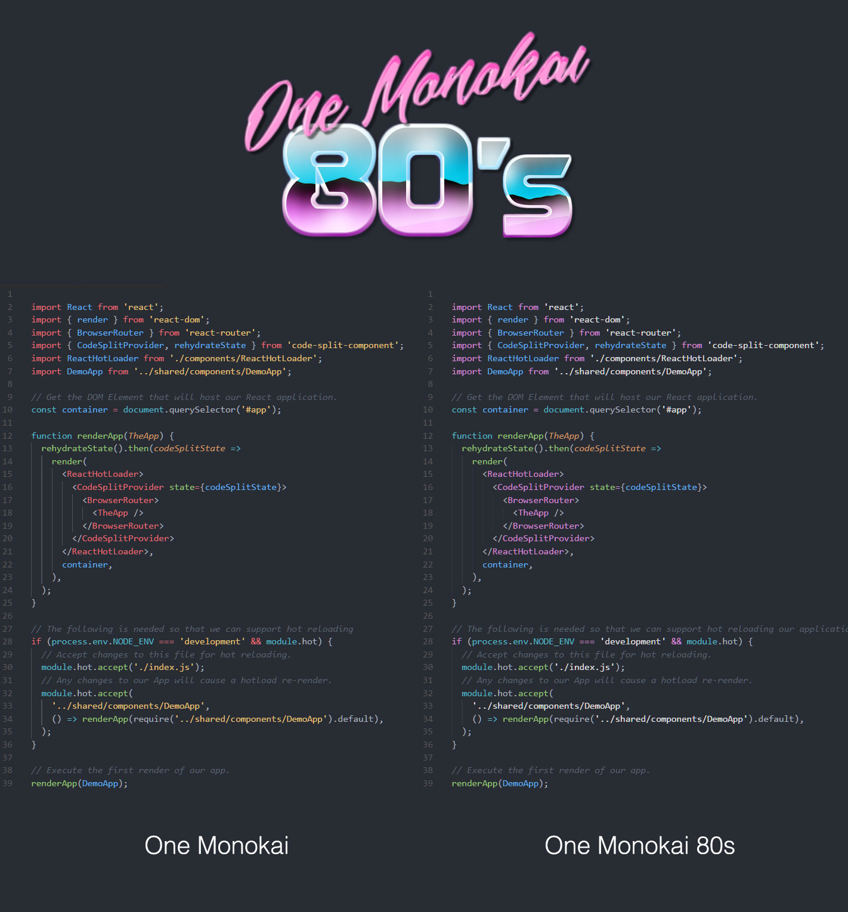

# One Monokai 80s Theme

A cross between [One Monokai](https://github.com/azemoh/vscode-one-monokai) and a Delorean.

   

## Config

It is recommended to turn ruler borders off in your settings when using this theme:

`
  "editor.overviewRulerBorder": false
`

## Other Editors

* [Jetbrains IntelliJ](https://github.com/marcelo-mason/one-monokai-80s/blob/master/Jetbrains/IntelliJEditorColors.jar)

* [Jetbrains Rider](https://github.com/marcelo-mason/one-monokai-80s/blob/master/Jetbrains/RiderEditorColors.jar)

Import the settings into your Jetbrains IDE via `File -> Import Settings`  It will only import EditorColors, the rest of your settings will not be modified.