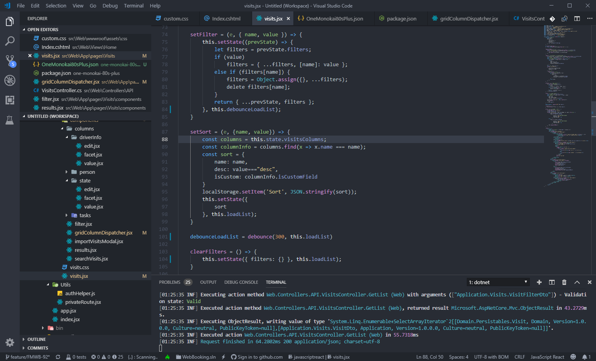
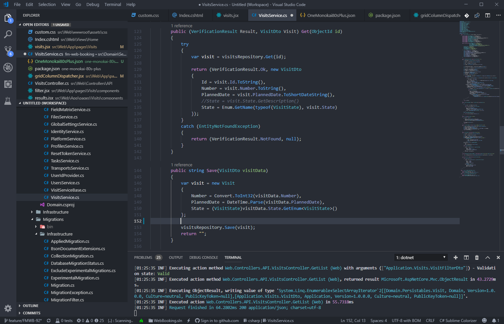

# One Monokai 80s Plus Theme

Fork from One Monokai 80s Theme (https://github.com/marcelo-mason/one-monokai-80s)
All credits goes to Marcelo Delgado (https://github.com/marcelo-mason)
One Monokai interface with One Monokai 80s Theme colors. And now with C#!

  

## Config

It is recommended to turn ruler borders off in your settings when using this theme:

`
  "editor.overviewRulerBorder": false
`