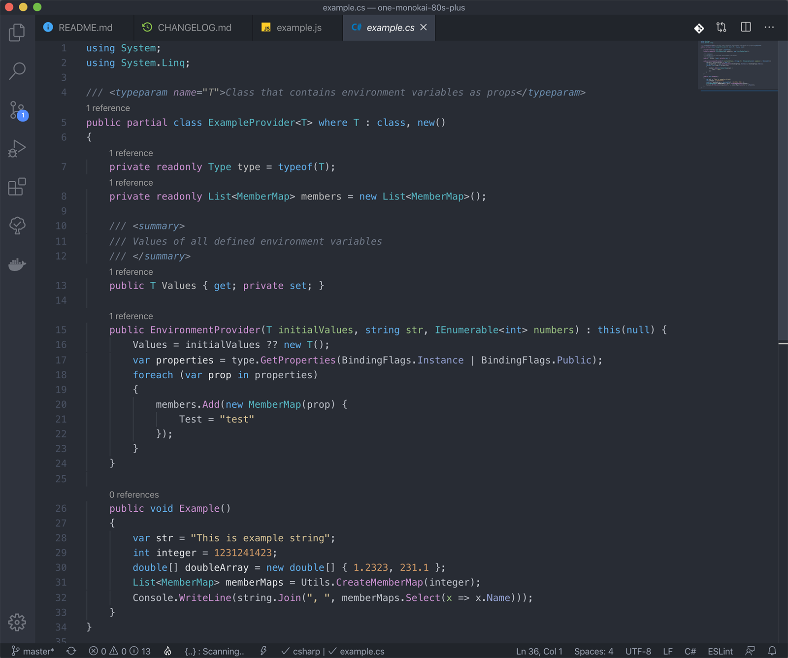

# One Monokai 80s Plus Theme

Fork from One Monokai 80s Theme (https://github.com/marcelo-mason/one-monokai-80s)

One Monokai interface with One Monokai 80s Theme colors. And now supports C# and other languages!

  

